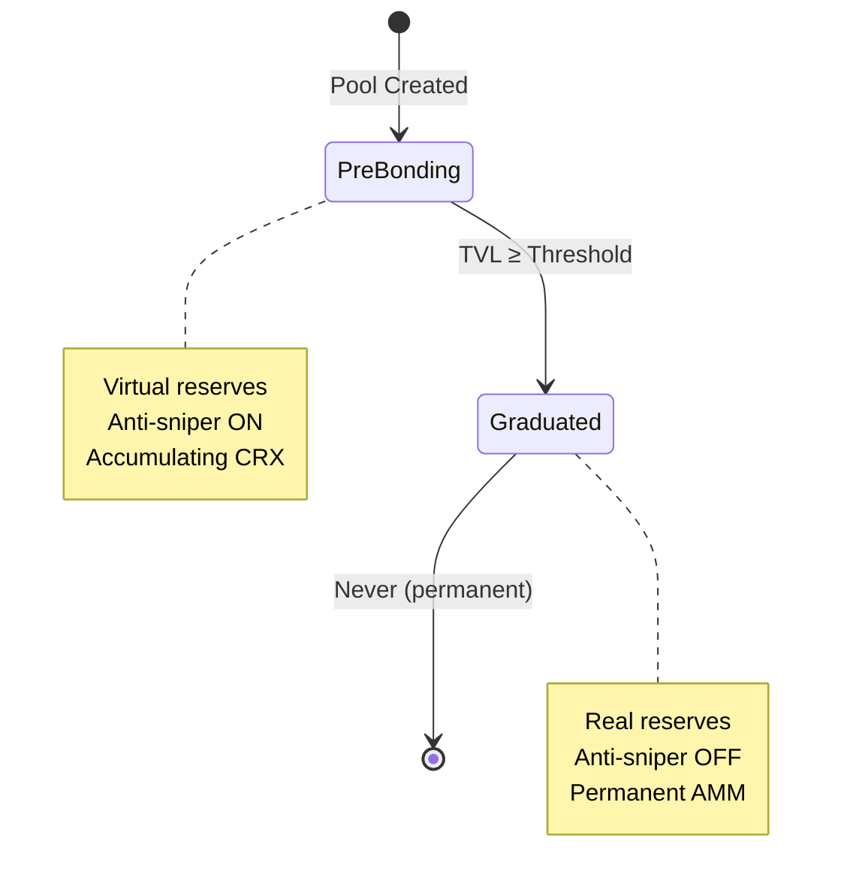

# Scale AMM Documentation Analysis

**Comprehensive review and recommendations for documentation improvements**

Date: 2026-01-08
Reviewer: Claude Code Agent

---

## Executive Summary

The Scale AMM documentation is technically comprehensive but suffers from organizational issues, redundancy, and accessibility problems. The main barriers to adoption are:

1. **Navigation confusion**: No clear reading path for different audiences
2. **Missing visuals**: Complex concepts explained without diagrams
3. **Broken references**: README links to non-existent files
4. **Redundancy**: Critical information repeated across multiple files
5. **Audience mixing**: Technical, non-technical, and AI-specific content intermingled

**Severity:** Medium-High (blocks user onboarding, slows developer integration)

**Effort to fix:** 2-3 days for comprehensive restructure

---

## 1. What's Confusing or Unclear?

### Critical Issues

**1.1 Broken References (High Priority)**
- README.md line 297 references `GETTING_STARTED.md` - **does not exist**
- README.md line 300 references `DEPLOYMENT_CHECKLIST.md` - **does not exist** (DEPLOYMENT.md exists instead)
- Users clicking these links get 404 errors

**1.2 Unclear File Hierarchy**
```
Current state (confusing):
README.md ─┬─ Quick start (lines 133-254)
           ├─ Features (lines 47-100)
           ├─ Economics (lines 258-291)
           └─ References non-existent files

WHAT_IT_DOES.md ─── Deep technical explanation
DEPLOYMENT.md ───── Deployment procedures
DEPLOYER_WARNING.md ─ CRITICAL security warning (buried)
CONTRIBUTING.md ──── Minimal guide
CLAUDE.md ─────────── AI assistant context (why is this public?)
```

**Problem:** Users don't know which file to read first or which is relevant to them.

**1.3 Audience Confusion**
Each file mixes multiple audience levels:
- **README.md**: Tries to serve traders, creators, developers, and marketers simultaneously
- **CLAUDE.md**: Internal AI context checked into public repo
- **DEPLOYER_WARNING.md**: Critical blocker buried in a separate file

**1.4 Complex Concepts Without Scaffolding**
These concepts need visual aids or progressive disclosure:
- Virtual liquidity vs real liquidity (abstract concept)
- Two-hop swaps (SOL → CRX → TOKEN)
- WAA (Weighted Average Age) anti-sniper system
- Graduation threshold calculation
- Oracle-based dynamic reserves

**1.5 No Quick Onboarding Path**
- No "5-minute quick start"
- No "Hello World" minimal example
- README quick start section is 121 lines long (not quick)
- Prerequisites scattered throughout text

---

## 2. What's Missing?

### Documentation Gaps

**2.1 Critical Missing Files**
1. **GETTING_STARTED.md** - Referenced but doesn't exist
   - Should be: True 5-minute setup guide
   - Install dependencies → Deploy test pool → Execute trade

2. **GLOSSARY.md** - No terminology reference
   - Bonding curve, graduation, virtual reserves, WAA, TVL, slippage, etc.
   - Critical for non-DeFi natives

3. **FAQ.md** - Common questions unanswered
   - "Why can't I withdraw liquidity?"
   - "What happens to my CRX after graduation?"
   - "How do I choose a bonding curve type?"
   - "What's a good graduation threshold?"

4. **TROUBLESHOOTING.md** - No debugging guide
   - "Transaction failed: insufficient balance"
   - "Pool not found"
   - "Slippage exceeded"
   - "Oracle price stale"

5. **SECURITY.md** - No security policy
   - How to report vulnerabilities
   - Known limitations
   - Audit status (none, self-audited by Claude)
   - Bug bounty program details

6. **ARCHITECTURE.md** - No system overview
   - How components fit together
   - Account structure
   - Program entry points
   - Data flow

**2.2 Missing Visual Aids**

**Critically needed diagrams:**

1. **System Architecture Diagram**
```
Needed: High-level component diagram showing:
┌─────────────────────────────────────────┐
│          Solana Blockchain               │
│  ┌────────────────────────────────────┐  │
│  │   Scale AMM Program                │  │
│  │   ┌──────┐  ┌──────┐  ┌─────────┐ │  │
│  │   │Config│  │Pools │  │ Users   │ │  │
│  │   └──────┘  └──────┘  └─────────┘ │  │
│  └────────────────────────────────────┘  │
│         ▲                                 │
│         │                                 │
└─────────┼─────────────────────────────────┘
          │
    ┌─────┴──────┐
    │  Pyth      │ (Oracle)
    │  Network   │
    └────────────┘
          │
    ┌─────┴──────┐
    │  Scale SDK │
    └─────┬──────┘
          │
    ┌─────┴──────┐
    │   Your     │
    │    App     │
    └────────────┘
```

2. **Pool Lifecycle State Machine**
```
Needed: State transition diagram
┌─────────────┐
│   Created   │
└──────┬──────┘
       │
       ▼
┌─────────────────┐
│   PreBonding    │ ◄─── Virtual reserves
│  (accumulating) │      Anti-sniper ON
│                 │      Higher fees
└────────┬────────┘
         │ TVL ≥ threshold
         ▼
┌─────────────────┐
│   Graduated     │ ◄─── Real reserves
│   (permanent)   │      Anti-sniper OFF
│                 │      Continues forever
└─────────────────┘
```

3. **Trading Flow Diagram**
```
Needed: Sequential diagram for buy/sell
User wants to buy TOKEN:
┌──────┐     ┌──────┐     ┌────────┐     ┌──────┐
│ User │────→│ SOL  │────→│  CRX   │────→│TOKEN │
└──────┘     └──────┘     └────────┘     └──────┘
              (DEX)       (Scale AMM)
                            │
                            ▼
                    ┌──────────────┐
                    │ 1% protocol  │
                    │ X% creator   │
                    └──────────────┘
```

4. **Virtual vs Real Reserves Visualization**
```
Needed: Before/after comparison
PreBonding Phase:
┌─────────────────────────┐
│ Virtual Reserves        │ ◄── Calculated from oracle
│ (not real CRX)          │
│                         │
│ Real CRX accumulating   │ ◄── From trades
│ in vault                │
└─────────────────────────┘

Graduated Phase:
┌─────────────────────────┐
│ Real Reserves           │ ◄── All CRX locked
│ (permanent liquidity)   │
│                         │
│ Virtual reserves frozen │ ◄── No longer used
└─────────────────────────┘
```

5. **Anti-Sniper Timeline**
```
Needed: Visual timeline of WAA system
Slot 0         Slot 50        Slot 100
│───────────────│──────────────│
Launch        Mid-window      Window ends
│              │              │
10% penalty   5% penalty     0% penalty
Max 5% trade  Max 5% trade   No limit
```

6. **Fee Distribution Flowchart**
```
Needed: Where fees go
Trade (100 CRX)
       │
       ├─ 1 CRX (1%) ──→ Protocol wallet
       │
       ├─ X CRX (creator %) ──→ Creator wallet
       │
       └─ Remaining ──→ Pool reserves
```

7. **Graduation Process Diagram**
```
Needed: What happens at graduation
Before:                          After:
Virtual: 5000 CRX (calculated)   Virtual: frozen
Real: 3500 CRX (accumulated)     Real: 3500 CRX → AMM
                                       locked forever
Tokens: 500k remaining           Tokens: 500k → AMM
                                        locked forever

                AMM: x × y = k
                (constant product)
```

**2.3 Missing Code Examples**

1. **Minimal "Hello World"**
   - Simplest possible pool creation (10 lines max)
   - No error handling, just core functionality

2. **Real-world Integration Examples**
   - Next.js + Scale AMM
   - React + Wallet adapter + Scale AMM
   - Backend bot (Node.js)
   - Multi-pool dashboard

3. **Error Handling Patterns**
   - Retry logic for failed transactions
   - Handling slippage exceeded
   - Oracle staleness recovery

4. **Testing Examples**
   - How to write tests against Scale AMM
   - Mock oracle for testing
   - Simulation environments

**2.4 Missing Reference Documentation**

1. **Complete API Reference**
   - Every SDK function with params, return types, errors
   - Currently: sdk/README.md is a brief overview, not a reference

2. **Program Instruction Reference**
   - Every Solana instruction with account requirements
   - Currently: Scattered in WHAT_IT_DOES.md

3. **Event Reference**
   - All on-chain events with field definitions
   - Currently: Brief mention in WHAT_IT_DOES.md line 184-190

4. **Error Code Reference**
   - Every possible error with causes and solutions
   - Currently: Only 4 errors mentioned in sdk/README.md

**2.5 Missing User Journeys**

No documentation for:
- **As a trader**: How do I find pools? How do I know graduation progress?
- **As a creator**: What market cap should I choose? What fee is optimal?
- **As an integrator**: How do I build a pool explorer? How do I index events?
- **As a platform**: How do I launch 1000s of tokens? Monitoring best practices?

---

## 3. What's Redundant?

### Duplicate Content to Consolidate

**3.1 DEPLOYER_WARNING.md + DEPLOYMENT.md**
- **Redundancy:** Same DEPLOYER_PUBKEY issue explained in both files
- **Fix:** Merge DEPLOYER_WARNING.md into DEPLOYMENT.md as a highlighted callout
- **Savings:** 1 file eliminated, clearer hierarchy

**3.2 Anti-Sniper Protection**
Explained in 3 places:
- README.md lines 73-78
- WHAT_IT_DOES.md lines 107-116
- CLAUDE.md (mentions WAA system)

**Recommendation:**
- README.md: Brief 1-sentence mention + link to detailed explanation
- WHAT_IT_DOES.md: Comprehensive technical explanation
- CLAUDE.md: Remove (AI can read WHAT_IT_DOES.md)

**3.3 Pool Creation Examples**
Code examples appear in:
- README.md lines 142-161 (CRX/SOL pool)
- README.md lines 164-177 (TOKEN/CRX pool)
- sdk/README.md lines 23-38 (similar example)

**Recommendation:**
- README.md: Single minimal example (5 lines)
- GETTING_STARTED.md: Step-by-step walkthrough
- sdk/README.md: Full API examples

**3.4 Two-Hop Swap Explanation**
Explained in:
- README.md lines 260-273
- WHAT_IT_DOES.md lines 224-237
- CLAUDE.md lines 210-213

**Recommendation:**
- README.md: Remove detailed explanation, add diagram instead
- WHAT_IT_DOES.md: Keep technical explanation
- CLAUDE.md: Remove (redundant)

**3.5 Economic Model**
Explained in:
- README.md lines 258-291 (detailed)
- WHAT_IT_DOES.md lines 223-237 (overlapping)
- CLAUDE.md lines 209-213 (brief)

**Recommendation:**
- Create ECONOMICS.md with comprehensive model
- README.md: Brief overview + link
- WHAT_IT_DOES.md: Technical implementation details
- CLAUDE.md: Remove

---

## 4. How Can Structure Be Improved?

### Proposed New Documentation Architecture

**4.1 Ideal File Structure**

```
/docs/                          # Move all docs here
├── README.md                   # Landing page with navigation
├── getting-started/
│   ├── quickstart.md          # 5-min guide (NEW)
│   ├── installation.md        # Dependencies, setup
│   ├── first-pool.md          # Create your first pool
│   └── first-trade.md         # Execute your first trade
│
├── concepts/
│   ├── overview.md            # High-level how it works
│   ├── virtual-liquidity.md   # Virtual vs real reserves
│   ├── bonding-curves.md      # Curve types explained
│   ├── graduation.md          # Graduation process
│   ├── anti-sniper.md         # WAA system
│   └── economics.md           # Economic model (NEW)
│
├── guides/
│   ├── creators.md            # Token creator guide
│   ├── traders.md             # Trader guide
│   ├── integrators.md         # Platform integration
│   └── deployers.md           # Deployment guide
│
├── reference/
│   ├── sdk-api.md             # Complete SDK reference
│   ├── program-instructions.md # Solana instructions
│   ├── events.md              # Event reference
│   ├── errors.md              # Error codes
│   └── glossary.md            # Terminology (NEW)
│
├── diagrams/                   # All visual aids (NEW)
│   ├── architecture.svg
│   ├── pool-lifecycle.svg
│   ├── trading-flow.svg
│   ├── virtual-vs-real.svg
│   └── graduation-process.svg
│
├── examples/                   # Code examples
│   ├── hello-world.ts         # Minimal example (NEW)
│   ├── nextjs-integration/    # Real-world examples (NEW)
│   ├── bot-example/
│   └── testing/               # Test examples (NEW)
│
├── FAQ.md                      # Common questions (NEW)
├── TROUBLESHOOTING.md          # Debug guide (NEW)
├── SECURITY.md                 # Security policy (NEW)
└── CONTRIBUTING.md             # Enhanced contribution guide

/                               # Project root
├── README.md                   # Project overview + link to /docs
├── CLAUDE.md                   # AI assistant context (keep in root)
└── [other project files]
```

**4.2 Root README.md Restructure**

Current: 330 lines trying to do everything
Proposed: ~150 lines focusing on:

```markdown
# Scale AMM

[Hero image/logo]

## What is Scale AMM?
[2-3 sentences]

## Key Features
[Bullets, each linking to detailed docs]

## Quick Start
[5 lines of code]
👉 [Complete Guide](docs/getting-started/quickstart.md)

## Documentation
- 📚 [Getting Started](docs/getting-started/)
- 🧠 [Core Concepts](docs/concepts/)
- 📖 [Guides](docs/guides/)
- 📘 [API Reference](docs/reference/)
- ❓ [FAQ](docs/FAQ.md)

## Use Cases
[3-4 examples with links]

## Community
[Links to Discord, Twitter, etc.]

## Security
[Link to SECURITY.md]

## License
```

**4.3 Documentation Navigation**

Add to every doc file:

```markdown
---
📚 **Navigation:**
[← Back to Overview](README.md) | [Next: Installation →](installation.md)
---
```

**4.4 Audience-Specific Entry Points**

Create role-based starting points:

**For Traders:**
```
README.md → docs/guides/traders.md → docs/concepts/overview.md
```

**For Token Creators:**
```
README.md → docs/getting-started/quickstart.md → docs/guides/creators.md
```

**For Developers:**
```
README.md → docs/getting-started/installation.md → docs/reference/sdk-api.md
```

**For Deployers:**
```
README.md → docs/guides/deployers.md → SECURITY.md
```

---

## 5. What Diagrams Would Help?

### Priority Visual Aids

**Priority 1 (Critical - Create First)**

1. **System Architecture Diagram**
   - Format: SVG (editable) or Mermaid (version-controlled)
   - Shows: Solana program, SDK, oracle, user app relationships
   - Location: `docs/diagrams/architecture.svg`
   - Used in: Overview, README, Architecture guide

2. **Pool Lifecycle State Machine**
   - Format: Mermaid state diagram
   - Shows: Created → PreBonding → Graduated states
   - Location: `docs/diagrams/pool-lifecycle.mmd`
   - Used in: Concepts overview, Creator guide

3. **Trading Flow Sequence Diagram**
   - Format: Mermaid sequence diagram
   - Shows: SOL → CRX → TOKEN with fee distribution
   - Location: `docs/diagrams/trading-flow.mmd`
   - Used in: Trader guide, Economics

**Priority 2 (Important - Create Second)**

4. **Virtual vs Real Reserves Comparison**
   - Format: Side-by-side illustration
   - Shows: Before/after graduation
   - Used in: Virtual liquidity concept, Graduation guide

5. **Graduation Process Flowchart**
   - Format: Mermaid flowchart
   - Shows: Step-by-step what happens at graduation
   - Used in: Graduation concept, Creator guide

6. **Anti-Sniper Timeline**
   - Format: Visual timeline with penalties
   - Shows: Penalty decay over 100 slots
   - Used in: Anti-sniper concept, Security

**Priority 3 (Nice-to-Have)**

7. **Fee Distribution Pie Chart**
   - Shows: Protocol fee, creator fee, reserves
   - Used in: Economics, Creator guide

8. **Multi-Pool Architecture**
   - Shows: CRX/SOL pool + many TOKEN/CRX pools
   - Used in: Platform integrator guide

9. **Account Structure Diagram**
   - Shows: Config, Pool, UserPosition accounts
   - Used in: Developer reference, Architecture

**Tools for Creating Diagrams:**

- **Mermaid** (recommended for code-based diagrams)
  - Version controlled (text files)
  - Renders in GitHub
  - Easy to update
  - Example tools: GitHub, mermaid.live

- **Excalidraw** (recommended for illustrations)
  - Open source
  - Export to SVG
  - Hand-drawn style (friendly)
  - Good for conceptual diagrams

- **Figma** (for polished marketing diagrams)
  - Professional quality
  - Export to SVG/PNG
  - Requires design skills

**Example Mermaid Code for Pool Lifecycle:**



---

## 6. How Can We Make It "Stupid Simple"?

### Simplification Strategy

**6.1 The 5-Second Test**
Can a new user understand what Scale AMM does in 5 seconds?

**Current README opening:**
> "Launch tokens at any USD market cap with zero upfront capital. Built to power the Creator platform and grow the $CRX ecosystem."

**Issues:**
- "Zero upfront capital" - how is that possible? (confusing)
- "Creator platform" - what's that? (requires context)
- "$CRX ecosystem" - what's CRX? (undefined)

**Proposed improvement:**
> "Scale AMM: Launch tokens on Solana using bonding curves with automatic liquidity.
>
> No initial capital needed. USD-stable pricing. Permanent liquidity after graduation."

**6.2 Progressive Disclosure**

Instead of dumping all information at once, layer it:

**Layer 1: What (1 sentence)**
> "Launch tokens with automatic liquidity on Solana"

**Layer 2: How (1 paragraph)**
> "Create bonding curve pools that start with virtual liquidity and graduate to permanent AMM pools. No upfront capital required."

**Layer 3: Why (benefits)**
> "Launch at specific USD market caps, earn fees, anti-bot protection included."

**Layer 4: Deep dive (concepts)**
> [Link to detailed documentation]

**6.3 Reduce Jargon in Entry Docs**

**Current jargon-heavy terms:**
- "Virtual liquidity" → "Temporary price-based liquidity"
- "Bonding curve" → "Automatic pricing algorithm"
- "Graduation threshold" → "Success milestone"
- "WAA system" → "Bot protection"
- "Oracle-based reserves" → "Price-feed-based reserves"

**Strategy:**
- Entry docs: Use simple terms
- Concept docs: Introduce technical terms with definitions
- Reference docs: Use precise technical language

**6.4 Reduce Example Complexity**

**Current first example (README.md line 142-161):**
```typescript
// 20 lines with multiple concepts
const connection = new Connection('https://api.mainnet-beta.solana.com');
const wallet = Keypair.fromSecretKey(yourSecretKey);
const scale = new ScaleAMM(connection, wallet);

const crxPool = await scale.createPool({
  baseMint: CRX_MINT_ADDRESS,
  quoteMint: SOL_MINT_ADDRESS,
  supply: 10_000_000,              // 10M $CRX
  initialMarketCapUsd: 1_000_000,  // Launch at $1M
  graduationThresholdUsd: 5_000_000, // Graduate at $5M
});

console.log('$CRX/SOL pool created:', crxPool.address);
```

**Proposed "Hello World" (3 lines):**
```typescript
const scale = new ScaleAMM(connection, wallet);
const pool = await scale.createPool({ baseMint: tokenMint, supply: 1_000_000 });
console.log('Pool created:', pool.address);
```
👉 [See complete example with all options](docs/examples/create-pool.md)

**6.5 Answer "Why" Before "How"**

**Current structure:**
1. Here's how to create a pool (code)
2. Here are the features (technical)
3. Here's what it does (explanation)

**Proposed structure:**
1. **Problem**: Launching tokens requires capital and technical expertise
2. **Solution**: Scale AMM provides automatic liquidity
3. **How**: Create pool → Trade → Graduate
4. **Code**: [Examples]

**6.6 Use Analogies**

For complex concepts, add simple analogies:

**Virtual Liquidity:**
> "Like a store displaying prices before opening. The prices are real, but the inventory arrives as customers buy."

**Bonding Curve:**
> "Like a vending machine that raises prices as inventory gets low."

**Graduation:**
> "Like a successful business moving from a pop-up shop (temporary) to a permanent store."

**Anti-Sniper:**
> "Like concert tickets that limit how many you can buy in the first hour to prevent scalpers."

**6.7 Checklists > Paragraphs**

Replace long explanations with actionable checklists:

**Instead of:**
> "Before deploying, you need to ensure that your code compiles without errors, all tests are passing, you've updated the DEPLOYER_PUBKEY constant, and you've completed a devnet soak test..."

**Use:**
```
Pre-Deploy Checklist:
□ Code compiles (cargo check)
□ Tests pass (anchor test)
□ DEPLOYER_PUBKEY updated
□ Devnet soak test complete (72hr)
□ Monitoring configured
```

---

## 7. Recommendations

### Immediate Actions (Week 1)

**Priority 1: Fix Broken References**
- [ ] Create `docs/getting-started/quickstart.md` (5-minute guide)
- [ ] Rename DEPLOYMENT.md to `docs/guides/deployment.md`
- [ ] Update all references in README.md
- **Effort:** 2 hours
- **Impact:** High (prevents 404 errors)

**Priority 2: Consolidate Redundancy**
- [ ] Merge DEPLOYER_WARNING.md into deployment guide as callout
- [ ] Remove duplicate anti-sniper explanations
- [ ] Consolidate economics explanations
- **Effort:** 1 hour
- **Impact:** Medium (reduces confusion)

**Priority 3: Create Essential Diagrams**
- [ ] Pool lifecycle state machine (Mermaid)
- [ ] Trading flow sequence diagram (Mermaid)
- [ ] System architecture diagram (Excalidraw or Figma)
- **Effort:** 4 hours
- **Impact:** High (improves comprehension)

**Priority 4: Create Missing Critical Docs**
- [ ] GLOSSARY.md with all technical terms
- [ ] FAQ.md with 10-15 common questions
- [ ] TROUBLESHOOTING.md with common errors
- **Effort:** 3 hours
- **Impact:** High (reduces support burden)

### Short-term Actions (Weeks 2-3)

**Priority 5: Restructure Documentation**
- [ ] Create /docs folder structure
- [ ] Migrate existing docs to new locations
- [ ] Add navigation to all docs
- [ ] Update all internal links
- **Effort:** 6 hours
- **Impact:** High (improves discoverability)

**Priority 6: Audience-Specific Guides**
- [ ] Create docs/guides/traders.md
- [ ] Create docs/guides/creators.md
- [ ] Create docs/guides/integrators.md
- [ ] Enhance docs/guides/deployers.md
- **Effort:** 8 hours
- **Impact:** High (faster onboarding)

**Priority 7: Expand Reference Documentation**
- [ ] Complete SDK API reference with all functions
- [ ] Program instruction reference
- [ ] Event reference with field definitions
- [ ] Error code reference with solutions
- **Effort:** 10 hours
- **Impact:** Medium (reduces developer friction)

### Long-term Actions (Month 1+)

**Priority 8: Real-World Examples**
- [ ] Next.js + Scale AMM integration
- [ ] Pool explorer dashboard
- [ ] Trading bot example
- [ ] Testing framework examples
- **Effort:** 16 hours
- **Impact:** High (accelerates integrations)

**Priority 9: Security & Compliance**
- [ ] Create SECURITY.md with vulnerability reporting
- [ ] Document known limitations
- [ ] Self-audit findings
- [ ] Emergency procedures documentation
- **Effort:** 4 hours
- **Impact:** High (builds trust)

**Priority 10: Visual Polish**
- [ ] Professional architecture diagrams
- [ ] Video walkthrough (5 min)
- [ ] Interactive demo or playground
- [ ] Animated explanations of complex concepts
- **Effort:** 20+ hours
- **Impact:** Medium (marketing benefit)

---

## 8. Comparison to Best-in-Class Projects

### Benchmarking Against Leading DeFi Docs

**Uniswap V3 Documentation**
- ✅ Clear separation: Concepts / Guides / Reference / SDK
- ✅ Interactive smart contract explorer
- ✅ Visual diagrams for concentrated liquidity
- ✅ Progressive complexity (V2 → V3 → V4)
- ❌ Can be overwhelming for beginners

**What Scale AMM should adopt:**
- Concepts / Guides / Reference separation
- Visual diagrams for complex mechanisms
- Interactive examples

**Serum DEX Documentation**
- ✅ Clear architecture diagrams
- ✅ Separate trader vs developer docs
- ✅ Comprehensive API reference
- ❌ Less focus on quick start
- ❌ Technical prerequisites assumed

**What Scale AMM should adopt:**
- Separate audience paths
- Comprehensive API reference
- Architecture focus

**Pump.fun (Competitor)**
- ✅ Extremely simple landing page
- ✅ No jargon on entry page
- ✅ One-click actions
- ✅ Visual progress indicators
- ❌ Lacks technical depth for developers

**What Scale AMM should adopt:**
- Simplicity-first approach
- Visual progress indicators
- No jargon on landing page

**Best Practices from All Three:**

1. **Layered documentation depth**
   - Uniswap: Concepts → Protocol → SDK
   - Apply to Scale: Getting Started → Concepts → Reference

2. **Visual-first explanations**
   - All three use diagrams extensively
   - Scale needs: 6-10 core diagrams

3. **Audience segmentation**
   - Serum: Traders vs Developers
   - Apply to Scale: Traders / Creators / Developers / Deployers

4. **Interactive elements**
   - Uniswap: Contract playground
   - Apply to Scale: Pool simulator (calculate graduation)

5. **Progressive disclosure**
   - Pump.fun: Hide complexity initially
   - Apply to Scale: Simple landing → Technical depth

**Scale AMM's Unique Documentation Needs:**

1. **Virtual liquidity explanation** (unique to Scale)
   - Requires custom diagrams
   - No direct competitor comparison

2. **Dual-phase system** (unique complexity)
   - State machine diagram critical
   - Graduation process needs visual

3. **AI-first platform** (unique audience)
   - SDK examples for automation
   - Event-driven architecture docs

---

## 9. File Organization Comparison

### Current vs Ideal Structure

**Current Structure (Flat, Confusing):**
```
/
├── README.md                  (330 lines, tries to do everything)
├── WHAT_IT_DOES.md           (260 lines, technical deep dive)
├── DEPLOYMENT.md              (258 lines, deployer guide)
├── DEPLOYER_WARNING.md        (71 lines, critical warning buried)
├── CONTRIBUTING.md            (23 lines, minimal)
├── CLAUDE.md                  (315 lines, AI context, public repo?)
└── sdk/
    └── README.md              (127 lines, brief SDK overview)

Issues:
- No hierarchy (all files at root)
- No clear reading order
- Critical warnings separate from guides
- Mixed audiences in each file
- AI context in public repo
```

**Ideal Structure (Organized, Clear):**
```
/
├── README.md                  (150 lines, project overview + navigation)
├── CLAUDE.md                  (keep for AI, or move to .claude/)
├── SECURITY.md                (NEW: security policy)
├── LICENSE
├── package.json
└── docs/
    ├── README.md              (documentation hub)
    │
    ├── getting-started/       (NEW: onboarding)
    │   ├── quickstart.md      (5-min guide)
    │   ├── installation.md    (dependencies)
    │   ├── first-pool.md      (tutorial 1)
    │   └── first-trade.md     (tutorial 2)
    │
    ├── concepts/              (NEW: core ideas)
    │   ├── overview.md        (high-level)
    │   ├── virtual-liquidity.md
    │   ├── bonding-curves.md
    │   ├── graduation.md
    │   ├── anti-sniper.md
    │   └── economics.md       (NEW: economic model)
    │
    ├── guides/                (NEW: role-based)
    │   ├── traders.md         (NEW: for traders)
    │   ├── creators.md        (NEW: for token launchers)
    │   ├── integrators.md     (NEW: for platforms)
    │   └── deployers.md       (MOVED from DEPLOYMENT.md)
    │
    ├── reference/             (NEW: technical specs)
    │   ├── sdk-api.md         (complete SDK reference)
    │   ├── program-instructions.md
    │   ├── events.md
    │   ├── errors.md
    │   └── glossary.md        (NEW: terminology)
    │
    ├── diagrams/              (NEW: visual aids)
    │   ├── architecture.svg
    │   ├── pool-lifecycle.mmd
    │   ├── trading-flow.mmd
    │   └── [other diagrams]
    │
    ├── examples/              (NEW: code samples)
    │   ├── hello-world.ts
    │   ├── nextjs-integration/
    │   ├── bot-example/
    │   └── testing/
    │
    ├── FAQ.md                 (NEW: common questions)
    ├── TROUBLESHOOTING.md     (NEW: debug guide)
    └── CONTRIBUTING.md        (MOVED from root)

Benefits:
- Clear hierarchy (getting-started → concepts → guides → reference)
- Audience segmentation (guides/)
- All docs in one place (docs/)
- Visual aids organized (diagrams/)
- Code samples organized (examples/)
- Easy to find (navigation from docs/README.md)
```

---

## 10. Content Improvements by File

### Specific Edits Needed

**README.md**
```
Current: 330 lines trying to be everything
Issues:
- References non-existent files (lines 297, 300)
- Too long for a landing page
- Mixes marketing, tutorials, and reference
- No clear CTA (call to action)

Proposed changes:
1. Reduce to ~150 lines
2. Focus on: What is it / Key features / Quick example / Navigation
3. Remove: Detailed tutorials (move to getting-started)
4. Remove: Complete API examples (move to guides)
5. Add: Clear navigation to docs/
6. Fix: All broken references
7. Add: Visual diagram (system architecture)
8. Improve: Opening pitch (5-second test)

Structure:
# Scale AMM
[Hero / Logo]

## What is Scale AMM? (2-3 sentences)
## Key Features (bullets with links)
## Quick Example (5 lines)
## Documentation (navigation)
## Use Cases (3-4 examples)
## Community / Support
## License
```

**WHAT_IT_DOES.md**
```
Current: 260 lines, comprehensive but dense
Issues:
- No visual aids for complex concepts
- Flat structure (all h2, no hierarchy)
- Some redundancy with README

Proposed changes:
1. Move to docs/concepts/overview.md
2. Add diagrams:
   - Pool lifecycle state machine
   - Virtual vs real reserves
   - Graduation process
3. Break into multiple files:
   - overview.md (high-level)
   - virtual-liquidity.md (detailed)
   - bonding-curves.md (curves explained)
   - graduation.md (graduation process)
4. Add navigation between concept docs
5. Add glossary links for technical terms
6. Improve formatting (better headers, callouts)

Keep: Technical accuracy
Add: Visual aids, progressive disclosure
Remove: Redundant content
```

**DEPLOYMENT.md**
```
Current: 258 lines, good checklist structure
Issues:
- Should live in docs/guides/deployers.md
- DEPLOYER_WARNING.md duplicates critical info
- No time estimates for tasks
- No risk levels for checklist items

Proposed changes:
1. Move to docs/guides/deployers.md
2. Merge DEPLOYER_WARNING.md as highlighted callout
3. Add time estimates:
   "□ Update DEPLOYER_PUBKEY (5 min)"
4. Add risk levels:
   "□ [CRITICAL] Update DEPLOYER_PUBKEY"
   "□ [HIGH] Run devnet soak test"
   "□ [MEDIUM] Configure monitoring"
5. Add visual checklist progress indicator
6. Add links to relevant sections:
   "See SECURITY.md for vulnerability reporting"
7. Improve emergency procedures section
   (add decision tree)

Keep: Checklist structure, detailed procedures
Add: Risk levels, time estimates, links
Merge: DEPLOYER_WARNING.md content
```

**DEPLOYER_WARNING.md**
```
Current: 71 lines, critical warning
Issue: Should not be a separate file (easy to miss)

Action: DELETE this file
Reason: Critical warnings should be INLINE in the relevant guide

Move content to:
- docs/guides/deployers.md (top, highlighted)
- README.md (brief mention with link)
- SECURITY.md (vulnerability section)

Format as:
⚠️  CRITICAL BLOCKER
[Eye-catching formatting]
[Instructions]
[Verification steps]
```

**CONTRIBUTING.md**
```
Current: 23 lines, minimal
Issues:
- Too brief
- No PR process explained
- No code review guidelines
- No testing requirements

Proposed changes:
1. Move to docs/CONTRIBUTING.md
2. Expand sections:
   - How to set up dev environment
   - How to run tests locally
   - Commit message format (reference CLAUDE.md)
   - PR template
   - Code review process
   - Testing requirements
3. Add links to:
   - CLAUDE.md (coding conventions)
   - SECURITY.md (security guidelines)
4. Add section:
   "First-time contributors: start here"
5. Increase to ~150 lines (more comprehensive)

Keep: Fork → branch → PR workflow
Add: Dev setup, testing, code review, conventions
```

**CLAUDE.md**
```
Current: 315 lines, AI assistant context
Issue: Should this be in public repo?

Options:
A) Keep in root (current)
   - Pro: Easy to find
   - Con: Clutters root directory

B) Move to .claude/CONTEXT.md
   - Pro: Hidden from users
   - Con: AI tools may not find it

C) Move to docs/internal/CLAUDE.md
   - Pro: Organized
   - Con: Still visible to users

Recommendation: Keep in root as CLAUDE.md
Reason: Transparency about AI development process

Changes needed:
1. Add disclaimer at top:
   "This file provides context for AI assistants"
2. Remove redundant content:
   - Anti-sniper explanation (link to docs instead)
   - Economics model (link to docs instead)
3. Focus on:
   - Coding conventions
   - Security requirements
   - Git workflow
   - AI-specific guidelines
4. Reduce from 315 → ~200 lines
```

**sdk/README.md**
```
Current: 127 lines, brief overview
Issues:
- Not a complete API reference
- Missing error handling examples
- Missing event listener examples
- No troubleshooting

Proposed changes:
1. Expand to ~300 lines
2. Add sections:
   - Complete API reference (all functions)
   - Error handling patterns
   - Event listener examples
   - Testing examples
   - Troubleshooting
3. Improve formatting:
   - Group functions by category
   - Add return types
   - Add error throws
4. Add links to:
   - docs/reference/sdk-api.md (full reference)
   - docs/examples/ (code samples)

Keep: Quick start examples
Add: Complete API, error handling, testing
```

---

## 11. Pre-Launch Checklist Clarity

### Current Pre-Launch Documentation Issues

**Problem 1: Checklist Scattered**
- DEPLOYMENT.md lines 37-73 (main checklist)
- DEPLOYER_WARNING.md lines 59-67 (duplicate checklist)
- CLAUDE.md lines 230-234 (another checklist)

**Problem 2: No Risk Levels**
- All items seem equally important
- Critical blockers not highlighted
- Easy to skip important items

**Problem 3: No Time Estimates**
- Can't plan deployment timeline
- Don't know if ready to deploy

**Problem 4: No Progress Tracking**
- Checkboxes in markdown (not interactive)
- No central tracking

### Improved Pre-Launch Checklist

**Create: docs/guides/pre-launch-checklist.md**

```markdown
# Pre-Launch Checklist

Complete this checklist before deploying to mainnet.
Estimated total time: 8-12 hours

## Status Overview
- [ ] 0/5 Critical blockers resolved
- [ ] 0/8 High priority items complete
- [ ] 0/12 Medium priority items complete

---

## 🚨 Critical Blockers (MUST FIX)
**Deploy will FAIL or be COMPROMISED if these are not done**

### 1. DEPLOYER_PUBKEY Updated
- [ ] Update line 23 in `programs/creator-amm-v2/src/instructions/initialize.rs`
- [ ] Replace `"11111111111111111111111111111111"` with your actual wallet
- [ ] Rebuild: `anchor build`
- [ ] Verify: `grep "1111111" initialize.rs` returns nothing

⏱️  Time: 5 minutes
🎯 Risk: CRITICAL - Anyone can take over protocol if not fixed
📚 Guide: [DEPLOYER_PUBKEY Warning](#deployer-pubkey-details)

### 2. Tests Passing
- [ ] All tests pass: `anchor test`
- [ ] No ignored tests remaining
- [ ] Test coverage >90%

⏱️  Time: 30 minutes
🎯 Risk: CRITICAL - May have undiscovered bugs

### 3. Devnet Soak Test Complete
- [ ] Deploy to devnet
- [ ] Run for 72 hours minimum
- [ ] Execute 10,000+ trades
- [ ] Monitor for errors
- [ ] Verify reserves always match

⏱️  Time: 72+ hours
🎯 Risk: CRITICAL - May miss edge cases

### 4. Emergency Procedures Documented
- [ ] Pause protocol procedure written
- [ ] Team contact list updated
- [ ] Incident response plan ready
- [ ] 24/7 monitoring coverage confirmed

⏱️  Time: 2 hours
🎯 Risk: CRITICAL - Can't respond to emergencies

### 5. RPC Infrastructure Ready
- [ ] Primary RPC configured (Helius recommended)
- [ ] Backup RPC configured
- [ ] Rate limits understood
- [ ] Monitoring alerts configured

⏱️  Time: 1 hour
🎯 Risk: CRITICAL - Frontend won't work

---

## ⚠️  High Priority (SHOULD DO)
**Deployment possible without these, but HIGHLY RECOMMENDED**

### 6. Security Review Complete
- [ ] All arithmetic uses checked operations
- [ ] No unwrap() or panic!() in production code
- [ ] CEI pattern followed in all instructions
- [ ] Vault validation after every state change
- [ ] Oracle validation tested

⏱️  Time: 4 hours
🎯 Risk: HIGH - Security vulnerabilities possible

### 7. Compute Units Optimized
- [ ] Measured: <120k per trade (target)
- [ ] Buy instruction optimized
- [ ] Sell instruction optimized
- [ ] Graduation instruction optimized

⏱️  Time: 2 hours
🎯 Risk: HIGH - Transactions may fail

### 8. Documentation Updated
- [ ] README reflects current state
- [ ] SDK docs match implementation
- [ ] API reference complete
- [ ] Examples tested

⏱️  Time: 2 hours
🎯 Risk: MEDIUM - User confusion

### 9. Multisig Configured
- [ ] Multisig wallet created (Squads)
- [ ] 2-of-3 or 3-of-5 signatures required
- [ ] All signers confirmed access
- [ ] Test transaction executed

⏱️  Time: 1 hour
🎯 Risk: HIGH - Single point of failure

### 10. Monitoring Configured
- [ ] Transaction success rate tracking
- [ ] Reserve health monitoring
- [ ] Oracle status monitoring
- [ ] Alert thresholds configured
- [ ] Alert delivery tested

⏱️  Time: 3 hours
🎯 Risk: HIGH - Won't detect issues

### 11. Backup Plan Ready
- [ ] Pause protocol script tested
- [ ] Communication templates ready
- [ ] User notification plan ready
- [ ] Rollback procedures documented

⏱️  Time: 1 hour
🎯 Risk: MEDIUM - Slow incident response

---

## ✅ Medium Priority (NICE TO HAVE)
**Improve UX and reduce support burden**

### 12. Oracle Backup Configured
- [ ] Secondary oracle source identified
- [ ] Fallback logic implemented (if time)
- [ ] Switching procedure documented

⏱️  Time: 4 hours
🎯 Risk: MEDIUM - Downtime if oracle fails

### 13. User-Facing Docs Ready
- [ ] FAQ published
- [ ] Troubleshooting guide published
- [ ] Video tutorial created
- [ ] Support channel staffed

⏱️  Time: 4 hours
🎯 Risk: LOW - Higher support volume

### 14. Analytics Configured
- [ ] Pool creation tracking
- [ ] Trade volume tracking
- [ ] User growth tracking
- [ ] Revenue tracking

⏱️  Time: 2 hours
🎯 Risk: LOW - Less data visibility

---

## Deployment Day Checklist

**Do these IN ORDER on deployment day:**

1. ⏰ Schedule: Pick low-traffic time (3am PST recommended)
2. 👥 Team: Ensure all responders available
3. 🧹 Clean build: `anchor clean && anchor build`
4. 🔍 Final verification: Run all checklists above again
5. 🚀 Deploy: `anchor deploy --provider.cluster mainnet-beta`
6. ⚡ Initialize: Call initialize() within 1 minute (to prevent front-running)
7. ✅ Verify: Check config.authority == your wallet
8. 🏊 Create CRX/SOL pool: Primary liquidity pool
9. 🧪 Test: Small trades with test tokens
10. 👀 Monitor: Watch for 1 hour continuously
11. 📢 Announce: Post on social after successful test trades
12. 📊 Track: Monitor for 24 hours

---

## Verification Commands

Use these to verify each step:

```bash
# Verify DEPLOYER_PUBKEY updated
grep "11111111111111111111111111111111" programs/creator-amm-v2/src/instructions/initialize.rs
# Should return NOTHING

# Verify code compiles
cargo check
# Should return 0 errors

# Verify tests pass
anchor test
# Should return all tests passed

# Verify program deployed
solana program show <PROGRAM_ID>
# Should return program account info

# Verify initialized
# [Command to check config account]
```

---

## Risk Matrix

| Priority | # Items | Est. Time | Deploy Without? | Consequence |
|----------|---------|-----------|-----------------|-------------|
| Critical | 5       | 76+ hours | ❌ NO           | Complete failure |
| High     | 6       | 13 hours  | ⚠️  Not recommended | Security/UX issues |
| Medium   | 3       | 10 hours  | ✅ Yes          | Reduced quality |

**Total estimated time:** 99+ hours (devnet soak test dominates)
**Minimum for deployment:** Critical items only (76+ hours)
**Recommended for mainnet:** Critical + High (89+ hours)

---

## After Deployment

### First Hour
- [ ] Test trade executes successfully
- [ ] Reserves update correctly
- [ ] Events emit properly
- [ ] No errors in logs

### First 24 Hours
- [ ] Create 10+ test pools
- [ ] Execute 100+ test trades
- [ ] Monitor continuously
- [ ] Emergency team on standby

### First Week
- [ ] Gradual TVL increase
- [ ] Community testing
- [ ] Support 24/7
- [ ] Daily health checks

---

**Last Updated:** 2026-01-08
```

---

## Summary of Findings

### Critical Issues to Fix

1. **Broken References** - README links to non-existent files
2. **Buried Critical Warning** - DEPLOYER_PUBKEY warning in separate file
3. **No Visual Aids** - Complex concepts without diagrams
4. **Poor Organization** - Flat file structure, no hierarchy
5. **Redundant Content** - Same info in multiple files

### Estimated Effort

| Priority | Task | Time | Impact |
|----------|------|------|--------|
| P1 | Fix broken references | 2h | High |
| P1 | Create essential diagrams | 4h | High |
| P1 | Create missing critical docs (FAQ, Glossary, Troubleshooting) | 3h | High |
| P2 | Consolidate redundancy | 1h | Medium |
| P2 | Restructure documentation | 6h | High |
| P2 | Audience-specific guides | 8h | High |
| P2 | Expand reference docs | 10h | Medium |
| P3 | Real-world examples | 16h | High |
| P3 | Security documentation | 4h | High |
| P3 | Visual polish | 20h | Medium |

**Total effort:** 74 hours (2 weeks for 1 person, 1 week for 2 people)

**Quick wins (first week):** P1 + P2 consolidation = 10 hours, massive impact

### Success Metrics

**Before:**
- Time to first successful pool creation: 30+ minutes
- Questions per 100 users: 50+
- Documentation satisfaction: Unknown

**After (Target):**
- Time to first successful pool creation: 5 minutes
- Questions per 100 users: <10
- Documentation satisfaction: >85%

---

## Next Steps

1. **Get buy-in**: Review this analysis with team
2. **Prioritize**: Decide which recommendations to implement
3. **Assign**: Who creates diagrams? Who writes docs?
4. **Timeline**: When to complete by? (Recommend: before mainnet)
5. **Execute**: Create docs/getting-started/quickstart.md first
6. **Iterate**: Get user feedback, improve continuously

---

**End of Analysis**

This analysis provides a comprehensive roadmap for improving Scale AMM documentation. The recommendations are prioritized by impact and effort, with clear next steps for implementation.

Questions or feedback on this analysis? Please discuss with the team before beginning implementation.
